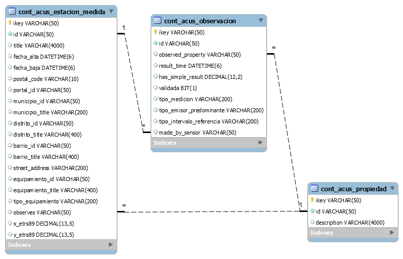

 

# DESARROLLO API REST DE DATOS REUTILIZABLE. MODELO DE TABLAS: 	CONTAMINACIÓN ACÚSTICA

&nbsp;

## **ÍNDICE**   
1. [AUTORES](#id1)
2. [LINKS](#id2)
3. [DIAGRAMA CONCEPTUAL](#id3)
4. [DIAGRAMA ENTIDAD RELACIÓN DE LAS TABLAS](#id40)
5. [TABLAS](#id4)  
    - [CONT_ACUS_ESTACION_MEDIDA](#id5)  
    - [CONT_ACUS_OBSERVACION](#id6)  
    - [CONT_ACUS_PROPIEDAD](#id7)  
6. [TAXONOMÍAS SKOS](#id111)
    - [TIPO-EMISOR-PREDOMINANTE](#id12)
    - [TIPO-EQUIPAMIENTO](#id13)
    - [TIPO-INTERVALO-REFERENCIA](#id14)

&nbsp;

## AUTORES 
- Edna Ruckhaus
- Hugo Lafuente Matesanz
- Leticia Rubalcaba
- Oscar Corcho
- Paola Espinoza Arias

&nbsp;

## LINKS 

Este documento contiene la información detallada del modelo de datos asociado al vocabulario de los convenios. A continuación, se detallan los enlaces de interés asociados a este vocabulario:

- *[Documentación](http://vocab.ciudadesabiertas.es/def/medio-ambiente/contaminacion-acustica/index-es.html)*
- *[Repositorio](https://github.com/CiudadesAbiertas/vocab-medio-ambiente-contaminacion-acustica)*
- *[Requisitos](https://github.com/CiudadesAbiertas/vocab-medio-ambiente-contaminacion-acustica/tree/master/requirements)*
- *[Issues](https://github.com/CiudadesAbiertas/vocab-medio-ambiente-contaminacion-acustica/issues)*

&nbsp;

## DIAGRAMA CONCEPTUAL 
&nbsp;

El diagrama muestra las clases y propiedades del vocabulario que representa la Deuda Pública Financiera como indicador esencial de las cuentas públicas de un ayuntamiento.

&nbsp;

&nbsp;

## DIAGRAMA ENTIDAD RELACIÓN DE LAS TABLAS 

&nbsp;

&nbsp;

## TABLAS     

[comment]: <!!!!!!!!!!!!!!!!!!!!!!!!!!!!!!!!!!!!!!!!!!!!!!!!!!!!!!!!!!!!!!!!!!!!!!!!!!!!!!!!!!!!!!!!> 
&nbsp;
### CONT_ACUS_ESTACION_MEDIDA 
&nbsp;   

|     Campo                 |     Tipo             |     Ejemplo                                     |     Descripción                                                                                                                                                                                                                                                                                                                                      |     URL                                                                                                                |
|---------------------------|----------------------|-------------------------------------------------|------------------------------------------------------------------------------------------------------------------------------------------------------------------------------------------------------------------------------------------------------------------------------------------------------------------------------------------------------|------------------------------------------------------------------------------------------------------------------------|
|     ikey                  |     VARCHAR(50)      |     CONTACUSTESTMED001                          |     Identificador   de la Tabla (PK).                                                                                                                                                                                                                                                                                                                |                                                                                                                        |
|     id                    |     VARCHAR(50)      |     CONTACUSTESTMED001                          |     Identificador   de la estación medida.                                                                                                                                                                                                                                                                                                           |                                                                                                                        |
|     title                 |     VARCHAR(4000)    |     Dispositivo   que detecta los ruidos I.     |     Nombre de la   estación medida.                                                                                                                                                                                                                                                                                                                  |     http://purl.org/dc/elements/1.1/title                                                                              |
|     fecha_alta            |     DATETIME(6)      |     2020-03-31 08:00:00.0                       |     Fecha de alta.                                                                                                                                                                                                                                                                                                                                   |     http://vocab.linkeddata.es/datosabiertos/def/urbanismo-infraestructuras/equipamiento-municipal#fechaAlta           |
|     fecha_baja            |     DATETIME(6)      |     2020-07-30 09:00:00.0                       |     Fecha de   baja.                                                                                                                                                                                                                                                                                                                                 |     http://vocab.linkeddata.es/datosabiertos/def/urbanismo-infraestructuras/equipamiento-municipal#fechaBaja           |
|     street_address        |     VARCHAR(200)     |     CL BLAS DE   OTERO 4                        |     La dirección   de la calle.                                                                                                                                                                                                                                                                                                                      |     http://schema.org/streetAddress                                                                                    |
|     postal_code           |     VARCHAR(10)      |     28100                                       |     El código   postal.                                                                                                                                                                                                                                                                                                                              |     http://schema.org/postalCode                                                                                       |
|     portal_id             |     VARCHAR(50)      |     PORTAL000119                                |     Identificador del portal                                                                                                                                                                                                                                                                                                                         |                                                                                                                        |
|     equipamiento_id       |     VARCHAR(50)      |     EQ0044                                      |     Identificador   del equipamiento.                                                                                                                                                                                                                                                                                                                |     http://vocab.linkeddata.es/datosabiertos/def/urbanismo-infraestructuras/equipamiento-municipal#id                  |
|     equipamiento_title    |     VARCHAR(400)     |     Teatro   Auditorio Ciudad de Alcobendas     |     Nombre del   equipamiento.                                                                                                                                                                                                                                                                                                                       |     http://vocab.linkeddata.es/datosabiertos/def/urbanismo-infraestructuras/equipamiento-municipal#nombre              |
|     tipo_equipamiento     |     VARCHAR(200)     |     Aparato de   medición A.C.M.E               |     URL SKOS:     http://vocab.linkeddata.es/datosabiertos/kos/urbanismo-infraestructuras/equipamiento/tipo-equipamiento                                                                                                                                                                                                                             |     http://vocab.linkeddata.es/datosabiertos/def/urbanismo-infraestructuras/equipamiento-municipal#tipoEquipamiento    |
|     observes              |     VARCHAR(50)      |     nivelRuido                                  |     Relación   entre el sensor y la propiedad que el sensor puede observar.                                                                                                                                                                                                                                                                          |     http://purl.oclc.org/NET/ssnx/ssn#observes                                                                         |
|     x_etrs89              |     DECIMAL(13,5)    |     440124.33000                                |     Coordenada X   en metros (ETRS89).                                                                                                                                                                                                                                                                                                               |     https://datos.ign.es/def/geo_core#xETRS89                                                                          |
|     y_etrs89              |     DECIMAL(13,5)    |     4474637.17000                               |     Coordenada Y   en metros (ETRS89).                                                                                                                                                                                                                                                                                                               |     https://datos.ign.es/def/geo_core#yETRS89                                                                          |
|     municipio_id          |     varchar(50)      |     28006                                       |     El identificador de un Municipio.                                                                                                                                                                                                                                                                                                                |     http://vocab.linkeddata.es/datosabiertos/def/sector-publico/territorio#Municipio                                   |
|     municipio_title       |     varchar(200)     |     Alcobendas                                  |     Nombre de un   Municipio.                                                                                                                                                                                                                                                                                                                        |     http://vocab.linkeddata.es/datosabiertos/def/sector-publico/territorio#Municipio                                   |
|     distrito_id           |     varchar(50)      |     2800601                                     |     Es el identificador de un distrito.   Un distrito es cada una de las demarcaciones en que se subdivide un   territorio o una población para distribuir y ordenar el ejercicio de los   derechos civiles y políticos, o de las funciones públicas, o de los servicios   administrativos [fuente: Diccionario de la Real Academia (DRAE) 2011].    |     http://vocab.linkeddata.es/datosabiertos/def/sector-publico/territorio#Distrito                                    |
|     distrito_title        |     varchar(400)     |     Unico                                       |     Nombre o   título de un distrito, se especifica con la propiedad dct:title,   geonames:name, y rdf:label es el proporcionado por el Registro de Entidades   Locales del Ministerio de Política Territorial, en   http://www.ine.es/nomen2/index.do                                                                                               |     http://vocab.linkeddata.es/datosabiertos/def/sector-publico/territorio#Distrito                                    |
|     barrio_id             |     varchar(50)      |     28006011                                    |     Identificador de un barrio.                                                                                                                                                                                                                                                                                                                      |     http://vocab.linkeddata.es/datosabiertos/def/sector-publico/territorio#Barrio                                      |
|     barrio_title          |     varchar(400)     |     Norte                                       |     Nombre del   barrio.                                                                                                                                                                                                                                                                                                                             |     http://vocab.linkeddata.es/datosabiertos/def/sector-publico/territorio#Barrio                                      |

[comment]: <!!!!!!!!!!!!!!!!!!!!!!!!!!!!!!!!!!!!!!!!!!!!!!!!!!!!!!!!!!!!!!!!!!!!!!!!!!!!!!!!!!!!!!!!> 
&nbsp;
### CONT_ACUS_OBSERVACION 
&nbsp;
|     Campo                        |     Tipo             |     Ejemplo                  |     Descripción                                                                                                                                                                                                                                                                                                                                                                                                                                                                                                                                                                                                                                                                                                                                                                           |     URL                                                                                                   |
|----------------------------------|----------------------|------------------------------|-------------------------------------------------------------------------------------------------------------------------------------------------------------------------------------------------------------------------------------------------------------------------------------------------------------------------------------------------------------------------------------------------------------------------------------------------------------------------------------------------------------------------------------------------------------------------------------------------------------------------------------------------------------------------------------------------------------------------------------------------------------------------------------------|-----------------------------------------------------------------------------------------------------------|
|     ikey                         |     VARCHAR(50)      |     CONACUOBS01              |     Identificador   de la Tabla (PK).                                                                                                                                                                                                                                                                                                                                                                                                                                                                                                                                                                                                                                                                                                                                                     |                                                                                                           |
|     id                           |     VARCHAR(50)      |     CONACUOBS01              |     El   identificador de la observación.                                                                                                                                                                                                                                                                                                                                                                                                                                                                                                                                                                                                                                                                                                                                                 |                                                                                                           |
|     observed_property            |     VARCHAR(50)      |     nivelRuido               |     Relación que vincula una Observación   con la Propiedad que se observó. Observed_property debe ser una propiedad   (hasProperty) de FeatureOfInterest (vinculada por featureOfInterest) de esta   observación.                                                                                                                                                                                                                                                                                                                                                                                                                                                                                                                                                                        |     http://purl.oclc.org/NET/ssnx/ssn#observedProperty                                                    |
|     result_time                  |     DATETIME         |     2020-04-15 08:00:00.0    |     Es el instante en el tiempo en la que   la observación se ha realizado.                                                                                                                                                                                                                                                                                                                                                                                                                                                                                                                                                                                                                                                                                                               |     http://www.w3.org/ns/sosa/resultTime                                                                  |
|     has_simple_result            |     DECIMAL(12,2)    |     135.01                   |     El valor de   una observación.                                                                                                                                                                                                                                                                                                                                                                                                                                                                                                                                                                                                                                                                                                                                                        |     http://www.w3.org/ns/sosa/hasSimpleResult                                                             |
|     validada                     |     BIT(1)           |     false                    |                                                                                                                                                                                                                                                                                                                                                                                                                                                                                                                                                                                                                                                                                                                                                                                           |     http://vocab.ciudadesabiertas.es/def/medio-ambiente/contaminacion-acustica#validada                   |
|     tipo_medicion                |     VARCHAR(200)     |     LAS50                    |     Cada   medición puede tener los siguientes tipos LAeq, LAs01, LAs10, LAs50, LAs90,   LAs99. Numérico, 5 dígitos. También puede ser LAw para medir posibles vibraciones.     URL SKOS:     http://vocab.linkeddata.es/datosabiertos/kos/medio-ambiente/contaminacion-acustica/tipo-medicion                                                                                                                                                                                                                                                                                                                                                                                                                                                                                            |     http://vocab.ciudadesabiertas.es/def/medio-ambiente/contaminacion-acustica#tipoMedida                 |
|     tipo_emisor_predominante     |     VARCHAR(200)     |     ferrocarriles            |     El tipo de   emisor está basado en en el listado obtenido en el artículo 12.2 de la Ley   37/2003, de 17 de noviembre, del Ruido. a) Vehículos automóviles. b)   Ferrocarriles. c) Aeronaves. d) Infraestructuras viarias. e) Infraestructuras   ferroviarias. f) Infraestructuras aeroportuarias. g) Maquinaria y equipos. h)   Obras de construcción de edificios y de ingeniería civil. i) Actividades   industriales. j) Actividades comerciales. k) Actividades   deportivo-recreativas y de ocio. l) Infraestructuras portuarias.     URL SKOS:      http://vocab.linkeddata.es/datosabiertos/kos/medio-ambiente/contaminacion-acustica/tipo-emisor-predominante                                                                                                                |     http://vocab.ciudadesabiertas.es/def/medio-ambiente/contaminacion-acustica#tipoEmisorPredominante     |
|     tipo_intervalo_referencia    |     VARCHAR(200)     |     D                        |     Basado en   cuatro tipos: (T, total, D diurno, E tarde, N noche) Lden - Indicador del   nivel de ruido global durante el día, la tarde y la noche, utilizado para   determinar la molestia vinculada a la exposición al ruido. Ld - Nivel sonoro   medio a largo plazo ponderado A, determinado a lo largo de todos los períodos   día (de 7 a 19 horas) del mes. Le - Nivel sonoro medio a largo plazo   ponderado A, determinado a lo largo de todos los períodos tarde (de 19 a 23   horas) del mes. Ln - Nivel sonoro medio a largo plazo ponderado A, definido   determinado a lo largo de todos los períodos noche (de 23 a 7 horas) del mes.     URL SKOS:     http://vocab.linkeddata.es/datosabiertos/kos/medio-ambiente/contaminacion-acustica/tipo-intervalo-referencia    |     http://vocab.ciudadesabiertas.es/def/medio-ambiente/contaminacion-acustica#tipoIntervaloReferencia    |
|     made_by_sensor               |     varchar(50)      |     CONTACUSTESTMED001       |     Relación   entre la observación y el sensor.                                                                                                                                                                                                                                                                                                                                                                                                                                                                                                                                                                                                                                                                                                                                          |     http://www.w3.org/ns/sosa/madeBySensor                                                                |

[comment]: <!!!!!!!!!!!!!!!!!!!!!!!!!!!!!!!!!!!!!!!!!!!!!!!!!!!!!!!!!!!!!!!!!!!!!!!!!!!!!!!!!!!!!!!!> 
&nbsp;
### CONT_ACUS_PROPIEDAD 
&nbsp;
|     Campo          |     Tipo             |     Ejemplo             |     Descripción                          |     URL                                            |
|--------------------|----------------------|-------------------------|------------------------------------------|----------------------------------------------------|
|     ikey           |     VARCHAR(50)      |     CONTACUSTPROP001    |     Identificador   de la Tabla (PK).    |                                                    |
|     id             |     VARCHAR(50)      |     nivelRuido          |     Identificador   de la propiedad.     |                                                    |
|     description    |     VARCHAR(4000)    |     nivelRuido          |     Descripción   de la propiedad.       |     http://purl.org/dc/elements/1.1/description    |

## TAXONOMÍAS SKOS 

&nbsp;
### TIPO-EMISOR-PREDOMINANTE 
http://vocab.linkeddata.es/datosabiertos/kos/medio-ambiente/contaminacion-acustica/tipo-emisor-predominante    

Tesauro que recoge los tipos de emisores de ruido o vibración basada en el listado obtenido en el artículo 12.2 de la Ley 37/2003, de 17 de noviembre, del Ruido.    
|     Tipo                               |     Label                                |     Definition                                                                                                           |
|----------------------------------------|------------------------------------------|--------------------------------------------------------------------------------------------------------------------------|
|     actividades-comerciales            |     actividades   comerciales            |     Contaminación   acústica provocada por un emisor de tipo actividades comerciales                                     |
|     actividades-deportivas-ocio        |     actividades deportivas y de ocio     |     Contaminación acústica provocada por un emisor de tipo   actividades deportivo-recreativas y de ocio                 |
|     actividades-industriales           |     actividades industriales             |     Contaminación acústica provocada por un emisor de tipo   actividades industriales                                    |
|     aeronaves                          |     aeronaves                            |     Contaminación acústica provocada por un emisor de tipo   aeronave                                                    |
|     ferrocarriles                      |     ferrocarriles                        |     Contaminación acústica provocada por un emisor de tipo   ferrocarril                                                 |
|     industrias-ferroviarias            |     industrias ferroviarias              |     Contaminación acústica provocada por un emisor de tipo   industria ferroviaria                                       |
|     industrias-viarias                 |     industrias viarias                   |     Contaminación acústica provocada por un emisor de tipo   industria viaria                                            |
|     infraestructuras-aeroportuarias    |     infraestructuras aeroportuarias      |     Contaminación acústica provocada por un emisor de tipo   infraestructura aeroportuaria                               |
|     infraestructuras-portuarias        |     infraestructuras portuarias          |     Contaminación acústica provocada por un emisor de tipo   infraestructura portuaria                                   |
|     maquinaria-equipos                 |     maquinaria y equipos                 |     Contaminación acústica provocada por un emisor de tipo   maquinaria y equipos                                        |
|     obras                              |     Obras                                |     Contaminación acústica provocada por un emisor de tipo obras   de construcción de edificios y de ingeniería civil    |
|     vehiculos-automoviles              |     vehículos automóviles                |     Contaminación acústica provocada por un emisor de tipo   vehículo automóvil.                                         |

[comment]: <!!!!!!!!!!!!!!!!!!!!!!!!!!!!!!!!!!!!!!!!!!!!!!!!!!!!!!!!!!!!!!!!!!!!!!!!!!!!!!!!!!!!!!!!> 
&nbsp;
### TIPO-EQUIPAMIENTO 
&nbsp;
http://vocab.linkeddata.es/datosabiertos/kos/urbanismo-infraestructuras/equipamiento/tipo-equipamiento    

Tesauro para tipos de equipamientos municipales.   

[comment]: <!!!!!!!!!!!!!!!!!!!!!!!!!!!!!!!!!!!!!!!!!!!!!!!!!!!!!!!!!!!!!!!!!!!!!!!!!!!!!!!!!!!!!!!!> 
&nbsp;
### TIPO-INTERVALO-REFERENCIA 
&nbsp;
http://vocab.linkeddata.es/datosabiertos/kos/medio-ambiente/contaminacion-acustica/tipo-intervalo-referencia    
Tesauro que recoge los tipos de indicadores de ruido global recogidos durante un periodo del día.
|     Tipo    |     Label    |     Definition                                                                                                                                                |
|-------------|--------------|---------------------------------------------------------------------------------------------------------------------------------------------------------------|
|     D       |     D        |     Nivel sonoro medio a largo plazo ponderado A, determinado a lo   largo de todos los períodos día (de 7 a 19 horas) del mes.                               |
|     E       |     E        |     Nivel sonoro medio a largo plazo ponderado A, determinado a lo   largo de todos los períodos tarde (de 19 a 23 horas) del mes                             |
|     N       |     N        |     Nivel sonoro medio a largo plazo ponderado A, definido   determinado a lo largo de todos los períodos noche (de 23 a 7 horas) del mes.                    |
|     T       |     T        |     Indicador del nivel de ruido global durante el día, la tarde y   la noche, utilizado para determinar la molestia vinculada a la exposición al   ruido.    |

[comment]: <!!!!!!!!!!!!!!!!!!!!!!!!!!!!!!!!!!!!!!!!!!!!!!!!!!!!!!!!!!!!!!!!!!!!!!!!!!!!!!!!!!!!!!!!> 

&nbsp;

